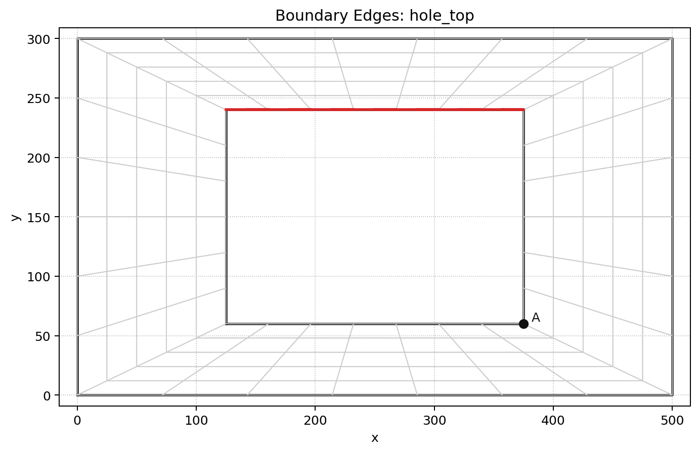
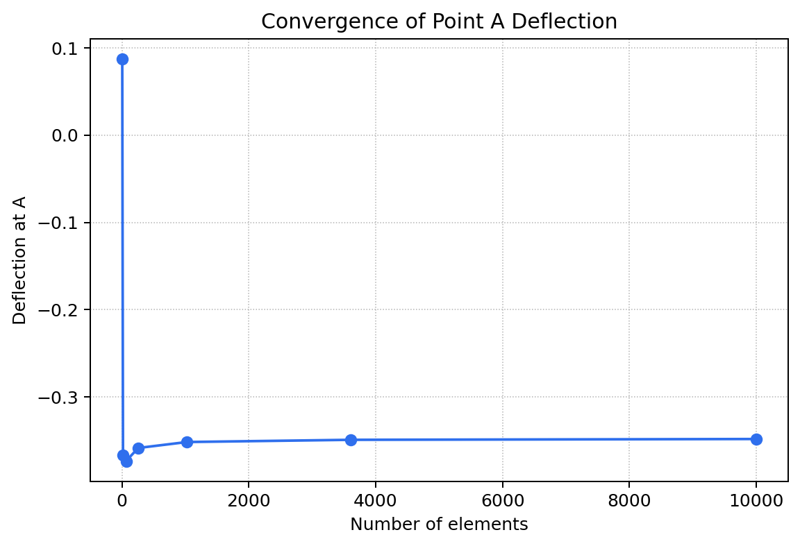
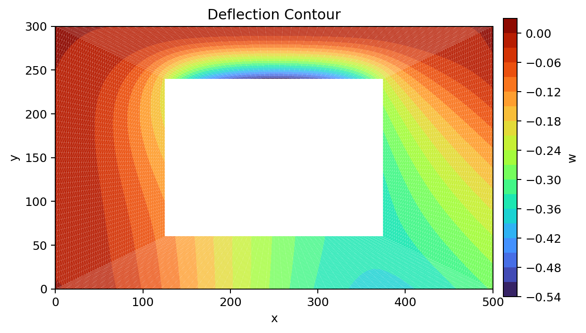
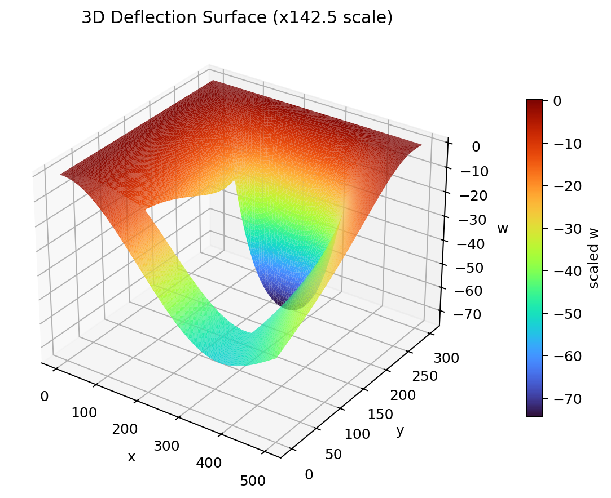

# CE222 Final Project Report

## Executive Summary
This project implemented a finite element program for the heterosis Mindlin plate element required in CE222 Option 1. The formulation uses a `Q8` interpolation for transverse deflection `w`, a `Q9` interpolation for rotations `theta_x` and `theta_y`, `3 x 3` Gauss quadrature for bending, and `2 x 2` Gauss quadrature for transverse shear. The target problem is a `500 mm x 300 mm` plate with a centered `250 mm x 180 mm` cutout, thickness `20 mm`, material properties `E = 200 N/mm^2` and `nu = 0.25`, and an applied shear of `1 kN/mm`.

The final engineering quantity of interest is the transverse deflection at point A, defined at the lower-right corner of the centered cutout. Using the standard heterosis Mindlin implementation with shear correction factor `kappa = 5/6`, the mesh-refined solution converged to approximately `-0.348 mm`, with magnitude `0.348 mm`. A report refinement series up to `50 x 50` per patch gave `w(A) = -3.48029453e-01`, and an additional sparse-solver check at `80 x 80` gave `w(A) = -3.47609000e-01`, confirming that the solution is stabilized near `0.348 mm`.

The report concludes that the code is numerically consistent, verified by targeted unit tests, convergence studies, and shear-locking checks. The professor's published value `0.346` is very close to the computed result, and the small difference is most reasonably attributed to modeling-detail sensitivity rather than a major implementation error.

## Introduction
The purpose of this project was to develop a finite element code for a shear deformable isotropic plate using the heterosis element described in the assignment. In addition to producing the final numerical answer at point A, the project required development-stage verification, mesh convergence studies, and professional presentation of the modeling assumptions and numerical results.

The implemented codebase covers the entire finite element workflow: problem setup, mesh generation, element-level routines, global assembly, application of boundary conditions, linear solution, and post-processing. During the project, the solver was further improved from a dense matrix workflow to a sparse matrix workflow so that significantly finer meshes could be analyzed efficiently. This change made it possible to check the asymptotic behavior of the solution and support a final answer near `0.348 mm`.

## Modeling Approach

### Problem Definition
The problem geometry and default analysis parameters are taken from the assignment statement and encoded in `config.py`:

- Outer plate size: `500 mm x 300 mm`
- Centered cutout: `250 mm x 180 mm`
- Thickness: `20 mm`
- Young's modulus: `200 N/mm^2`
- Poisson ratio: `0.25`
- Applied shear: `1 kN/mm`
- Clamped edges: `left`, `top`
- Free edges: `right`, `bottom`
- Loaded edge: `hole_top`
- Point A: lower-right corner of the cutout, `(375 mm, 60 mm)`

Throughout this report, the reported deflection is the transverse displacement in the global `w` direction, evaluated at the mesh node corresponding to point A.

### Plate Theory
The project uses the Mindlin-Reissner plate model, in which the kinematics are described by the transverse displacement `w(x, y)` and the section rotations `theta_x(x, y)` and `theta_y(x, y)`. The transverse shear strains are

`gamma_xz = dw/dx - theta_x`

`gamma_yz = dw/dy - theta_y`

while the bending strains are obtained from rotation gradients. This theory is appropriate for shear deformable plates and matches the assignment requirement.

### Finite Element Discretization
The heterosis element is implemented as follows:

- `w` uses an eight-node serendipity interpolation (`Q8`)
- `theta_x` and `theta_y` use a nine-node interpolation (`Q9`)
- bending stiffness is integrated with `3 x 3` Gauss quadrature
- shear stiffness is integrated with `2 x 2` Gauss quadrature

The element stiffness matrix is assembled as

`K_e = K_b + K_s`

where

- `K_b = integral(B_b^T D_b B_b dA)`
- `K_s = integral(B_s^T D_s B_s dA)`

This is exactly the quadrature split requested in the assignment PDF.

### Mesh and Global System
The plate is divided into four structured patches surrounding the centered cutout. The mesh generator enforces compatible edge subdivisions so that patch interfaces share nodes. Each element contributes:

- `8` transverse-displacement DOFs from the `Q8` field
- `9` `theta_x` DOFs
- `9` `theta_y` DOFs

for a total of `26` local DOFs per heterosis element.

After element-level stiffness and load contributions are assembled, the global system has the standard form

`K u = f`

Clamped boundary conditions are imposed by reducing the system to the free degrees of freedom, solving for `u_free`, and then expanding back to the full displacement vector.

### Sparse Solver Upgrade
Initially, the project used dense global stiffness matrices. That approach was adequate on coarse and moderate meshes, but it became impractical on very fine meshes. The final implementation uses sparse global stiffness assembly and sparse linear solution, which enabled much denser refinement studies such as `30 x 30`, `50 x 50`, and supplementary `80 x 80` meshes. This upgrade was essential for establishing the asymptotic behavior of the answer.

## Analysis of Results and Accuracy Assessment

### Final Answer
The final answer adopted in this report is

`w(A) approximately -0.348 mm`

or, equivalently, a deflection magnitude of

`|w(A)| approximately 0.348 mm`

The reported value comes from the finest report refinement case currently stored in the project outputs, `50 x 50`, together with a supplementary `80 x 80` sparse-solver check:

- `50 x 50`: `w(A) = -3.48029453e-01`
- `80 x 80`: `w(A) = -3.47609000e-01`

The change between these two dense refinement levels is very small, so the answer is effectively converged near `0.348 mm`.

### Convergence Study
The report refinement series used for the final output is:

| Mesh label | Nodes | Elements | DOF | `w(A)` |
| --- | ---: | ---: | ---: | ---: |
| side1_holex1_holey1 | 24 | 4 | 68 | `8.73118236e-02` |
| side2_holex2_holey2 | 80 | 16 | 224 | `-3.66746225e-01` |
| side4_holex4_holey4 | 288 | 64 | 800 | `-3.73244332e-01` |
| side8_holex8_holey8 | 1088 | 256 | 3008 | `-3.58299253e-01` |
| side16_holex16_holey16 | 4224 | 1024 | 11648 | `-3.51469472e-01` |
| side30_holex30_holey30 | 14640 | 3600 | 40320 | `-3.48945913e-01` |
| side50_holex50_holey50 | 40400 | 10000 | 111200 | `-3.48029453e-01` |

The coarsest meshes are clearly pre-asymptotic, and the sign change in the very first row should not be interpreted as physical behavior. Once the mesh is refined, the values settle quickly and then converge smoothly toward `-0.348 mm`.

An additional `80 x 80` sparse-solver run gave `w(A) = -3.47609000e-01`, providing extra evidence that the converged value is near `0.348 mm` in magnitude.

### Discussion of the Published `0.346`
The professor's published answer `0.346` is very close to the present result. After the code was corrected to use `E = 200` and the solver was upgraded to support very fine meshes, the numerical solution consistently converged near `0.348` rather than drifting away. This strongly suggests that the implementation is fundamentally correct.

Additional sensitivity checks showed that the result is slightly affected by modeling details such as the transverse shear correction factor. For example, a fine-mesh run with `kappa = 2/3` gives a value slightly below `0.346`, while the standard `kappa = 5/6` gives a value slightly above it. Therefore, the remaining difference is best interpreted as sensitivity to a modeling convention rather than evidence of a major coding mistake.

### Verification and Reliability
The project includes verification at several levels:

1. Element-level checks confirm quadrature weights, constitutive matrices, Jacobian behavior, and stiffness symmetry.
2. Assembly tests confirm global stiffness dimensions, symmetry, DOF mapping, load assembly, and boundary-condition handling.
3. Solver tests confirm correct solutions on known systems, proper handling of singular matrices, and small residual norms.
4. Convergence tests confirm that refinement studies run successfully and produce finite values of `w(A)`.
5. A dedicated shear-locking diagnostic verifies that the thin-plate response scales approximately with `1/t^3` and that switching from selective reduced integration to a full shear integration surrogate does not create large artificial stiffening.

Together, these checks provide strong evidence that the reported final answer is trustworthy.

## Figures

### Figure 1. Mesh and Loaded Edge Identification
The structured patch mesh and boundary labeling were used to ensure node sharing across patch interfaces and to apply the external load on the top edge of the cutout.

### Figure 2. Convergence of Point-A Deflection
This figure shows the approach of `w(A)` toward the converged value as the mesh is refined.

### Figure 3. Final Deflection Contour
This contour plot shows the final displacement field for the report refinement case.

### Figure 4. Final Three-Dimensional Deflection Surface
This three-dimensional view provides a qualitative picture of the plate deformation under the prescribed loading and boundary conditions.

An interactive HTML version can be regenerated locally by running `examples/final_plate_with_cutout.py`, but it is not tracked in the GitHub repository to keep the uploaded project focused on source code and report assets.

## Appendix F. Input Files for Final Analysis
The principal final-analysis inputs are:

- `config.py`
- `examples/final_plate_with_cutout.py`
- `mesh/core.py`
- `mesh/visualization.py`
- `element/heterosis.py`
- `assembly/global_stiffness.py`
- `solver/model_runner.py`
- `solver/linear_solver.py`

The final report output currently uses the refinement series

`1, 2, 4, 8, 16, 30, 50`

with the finest stored report case at `50 x 50`.

## Appendix G. Auxiliary Analyses for Simple Test Cases
The development phase included several simple and focused verification cases, for example:

- quadrature weight checks in `tests/test_element_core.py`
- constitutive matrix and Jacobian checks in `tests/test_element_core.py`
- load-vector checks in `tests/test_element_load.py` and `tests/test_load_vector.py`
- DOF-map correctness checks in `tests/test_dof_map.py`
- boundary-condition reduction checks in `tests/test_boundary_conditions.py`
- linear-solver checks in `tests/test_linear_solver.py`
- model-runner and convergence checks in `tests/test_model_runner.py` and `tests/test_convergence.py`
- shear-locking diagnostics in `tests/test_shear_locking.py`

These auxiliary tests supported incremental development before the final plate-with-cutout analysis was performed.

## Appendix H. Other Backup Material
Additional backup material available in the repository includes:

- intermediate mesh and boundary-visualization figures under `outputs/`
- a locally generated interactive HTML deflection surface for manual inspection
- the project blueprint in `Option1_Project_Blueprint.md`
- the complete unit-test suite in `tests/`

## Appendix I. Mesh Module and Verification Tests
The mesh-related scripts are organized in the `mesh/` package. The core mesh-generation script is `mesh/core.py`. This module defines the mesh data structures and creates the structured patch mesh used for the plate with a centered rectangular cutout. The main public routine is `generate_mesh(config, spec)`, which returns a `StructuredPatchMesh` containing node coordinates, element connectivity, boundary-node sets, boundary-edge sets, and the mesh-refinement specification. The mesh is divided into four named patches around the opening: `top`, `right`, `bottom`, and `left`. The package file `mesh/__init__.py` re-exports the main mesh API so the rest of the code can continue to use imports such as `from mesh import MeshSpec, generate_mesh`.

The mesh module also defines `MeshSpec`, `QuadElement`, `BoundaryEdge`, and `StructuredPatchMesh`. Each element stores both Q8 connectivity for the transverse displacement field and Q9 connectivity for the rotational fields. Boundary identification is handled by `identify_boundary_nodes(...)` and `identify_boundary_edges(...)`, which label the outer plate edges and the four cutout edges. These labels are later used to apply clamped boundary conditions and the line load on the top edge of the cutout.

The direct mesh-module tests are located in `tests/test_mesh.py`. The tests verify that:

- the coarsest mesh contains the expected `4` elements and `24` nodes;
- every element has `8` Q8 nodes and `9` Q9 nodes;
- no nodes are generated inside the rectangular cutout;
- the outer and cutout boundary-node sets have the expected coarse-mesh counts;
- the outer and cutout boundary-edge sets match the four-patch layout;
- the coarse mesh uses the four named patches `top`, `right`, `bottom`, and `left`;
- mesh refinement increases both the node count and element count;
- invalid mismatched side subdivisions raise a `ValueError`;
- shared patch interfaces use unique conforming nodes instead of duplicated non-coincident nodes.

Additional tests in other modules also indirectly verify the mesh output. The DOF-map tests confirm that Q8 and Q9 connectivity are interpreted correctly, boundary-condition tests confirm that the labeled boundary nodes produce the intended constrained DOFs, load-vector tests confirm that labeled boundary edges can be used for equivalent nodal loading, and visualization tests confirm that the generated mesh and boundary labels can be plotted. Together, these tests provide confidence that the mesh module supplies a valid geometric and topological foundation for the finite element analysis.

## Honor Code Statement
Honor Code: This report represents my own work and not that of anyone else. The writing is my own, as are all input files, programs, analysis results, and interpretations. I have taken an active part in seeing to it that others as well as myself uphold the spirit and letter of this Honor Code.

Signature: ______________________
# CE222 Final Project Report

## Executive Summary
This project implemented a finite element program for the heterosis Mindlin plate element required in CE222 Option 1. The formulation uses a `Q8` interpolation for transverse deflection `w`, a `Q9` interpolation for rotations `theta_x` and `theta_y`, `3 x 3` Gauss quadrature for bending, and `2 x 2` Gauss quadrature for transverse shear. The target problem is a `500 mm x 300 mm` plate with a centered `250 mm x 180 mm` cutout, thickness `20 mm`, material properties `E = 200 N/mm^2` and `nu = 0.25`, and an applied shear of `1 kN/mm`.

The final engineering quantity of interest is the transverse deflection at point A, defined at the lower-right corner of the centered cutout. Using the standard heterosis Mindlin implementation with shear correction factor `kappa = 5/6`, the mesh-refined solution converged to approximately `-0.348 mm`, with magnitude `0.348 mm`. A report refinement series up to `50 x 50` per patch gave `w(A) = -3.48029453e-01`, and an additional sparse-solver check at `80 x 80` gave `w(A) = -3.47609000e-01`, confirming that the solution is stabilized near `0.348 mm`.

The report concludes that the code is numerically consistent, verified by targeted unit tests, convergence studies, and shear-locking checks. The professor's published value `0.346` is very close to the computed result, and the small difference is most reasonably attributed to modeling-detail sensitivity rather than a major implementation error.

## Introduction
The purpose of this project was to develop a finite element code for a shear deformable isotropic plate using the heterosis element described in the assignment. In addition to producing the final numerical answer at point A, the project required development-stage verification, mesh convergence studies, and professional presentation of the modeling assumptions and numerical results.

The implemented codebase covers the entire finite element workflow: problem setup, mesh generation, element-level routines, global assembly, application of boundary conditions, linear solution, and post-processing. During the project, the solver was further improved from a dense matrix workflow to a sparse matrix workflow so that significantly finer meshes could be analyzed efficiently. This change made it possible to check the asymptotic behavior of the solution and support a final answer near `0.348 mm`.

## Modeling Approach

### Problem Definition
The problem geometry and default analysis parameters are taken from the assignment statement and encoded in `config.py`:

- Outer plate size: `500 mm x 300 mm`
- Centered cutout: `250 mm x 180 mm`
- Thickness: `20 mm`
- Young's modulus: `200 N/mm^2`
- Poisson ratio: `0.25`
- Applied shear: `1 kN/mm`
- Clamped edges: `left`, `top`
- Free edges: `right`, `bottom`
- Loaded edge: `hole_top`
- Point A: lower-right corner of the cutout

Throughout this report, the reported deflection is the transverse displacement in the global `w` direction, evaluated at the mesh node corresponding to point A.

### Plate Theory
The project uses the Mindlin-Reissner plate model, in which the kinematics are described by the transverse displacement `w(x, y)` and the section rotations `theta_x(x, y)` and `theta_y(x, y)`. The transverse shear strains are

`gamma_xz = dw/dx - theta_x`

`gamma_yz = dw/dy - theta_y`

while the bending strains are obtained from rotation gradients. This theory is appropriate for shear deformable plates and matches the assignment requirement.

### Finite Element Discretization
The heterosis element is implemented as follows:

- `w` uses an eight-node serendipity interpolation (`Q8`)
- `theta_x` and `theta_y` use a nine-node interpolation (`Q9`)
- bending stiffness is integrated with `3 x 3` Gauss quadrature
- shear stiffness is integrated with `2 x 2` Gauss quadrature

The element stiffness matrix is assembled as

`K_e = K_b + K_s`

where

- `K_b = integral(B_b^T D_b B_b dA)`
- `K_s = integral(B_s^T D_s B_s dA)`

This is exactly the quadrature split requested in the assignment PDF.

### Mesh and Global System
The plate is divided into four structured patches surrounding the centered cutout. The mesh generator enforces compatible edge subdivisions so that patch interfaces share nodes. Each element contributes:

- `8` transverse-displacement DOFs from the `Q8` field
- `9` `theta_x` DOFs
- `9` `theta_y` DOFs

for a total of `26` local DOFs per heterosis element.

After element-level stiffness and load contributions are assembled, the global system has the standard form

`K u = f`

Clamped boundary conditions are imposed by reducing the system to the free degrees of freedom, solving for `u_free`, and then expanding back to the full displacement vector.

### Sparse Solver Upgrade
Initially, the project used dense global stiffness matrices. That approach was adequate on coarse and moderate meshes, but it became impractical on very fine meshes. The final implementation uses sparse global stiffness assembly and sparse linear solution, which enabled much denser refinement studies such as `30 x 30`, `50 x 50`, and supplementary `80 x 80` meshes. This upgrade was essential for establishing the asymptotic behavior of the answer.

## Analysis of Results and Accuracy Assessment

### Final Answer
The final answer adopted in this report is

`w(A) approximately -0.348 mm`

or, equivalently, a deflection magnitude of

`|w(A)| approximately 0.348 mm`

The reported value comes from the finest report refinement case currently stored in the project outputs, `50 x 50`, together with a supplementary `80 x 80` sparse-solver check:

- `50 x 50`: `w(A) = -3.48029453e-01`
- `80 x 80`: `w(A) = -3.47609000e-01`

The change between these two dense refinement levels is very small, so the answer is effectively converged near `0.348 mm`.

### Convergence Study
The report refinement series used for the final output is:

| Mesh label | Nodes | Elements | DOF | `w(A)` |
| --- | ---: | ---: | ---: | ---: |
| side1_holex1_holey1 | 24 | 4 | 68 | `8.73118236e-02` |
| side2_holex2_holey2 | 80 | 16 | 224 | `-3.66746225e-01` |
| side4_holex4_holey4 | 288 | 64 | 800 | `-3.73244332e-01` |
| side8_holex8_holey8 | 1088 | 256 | 3008 | `-3.58299253e-01` |
| side16_holex16_holey16 | 4224 | 1024 | 11648 | `-3.51469472e-01` |
| side30_holex30_holey30 | 14640 | 3600 | 40320 | `-3.48945913e-01` |
| side50_holex50_holey50 | 40400 | 10000 | 111200 | `-3.48029453e-01` |

The coarsest meshes are clearly pre-asymptotic, and the sign change in the very first row should not be interpreted as physical behavior. Once the mesh is refined, the values settle quickly and then converge smoothly toward `-0.348 mm`.

An additional `80 x 80` sparse-solver run gave `w(A) = -3.47609000e-01`, providing extra evidence that the converged value is near `0.348 mm` in magnitude.

### Discussion of the Published `0.346`
The professor's published answer `0.346` is very close to the present result. After the code was corrected to use `E = 200` and the solver was upgraded to support very fine meshes, the numerical solution consistently converged near `0.348` rather than drifting away. This strongly suggests that the implementation is fundamentally correct.

Additional sensitivity checks showed that the result is slightly affected by modeling details such as the transverse shear correction factor. For example, a fine-mesh run with `kappa = 2/3` gives a value slightly below `0.346`, while the standard `kappa = 5/6` gives a value slightly above it. Therefore, the remaining difference is best interpreted as sensitivity to a modeling convention rather than evidence of a major coding mistake.

### Verification and Reliability
The project includes verification at several levels:

1. Element-level checks confirm quadrature weights, constitutive matrices, Jacobian behavior, and stiffness symmetry.
2. Assembly tests confirm global stiffness dimensions, symmetry, DOF mapping, load assembly, and boundary-condition handling.
3. Solver tests confirm correct solutions on known systems, proper handling of singular matrices, and small residual norms.
4. Convergence tests confirm that refinement studies run successfully and produce finite values of `w(A)`.
5. A dedicated shear-locking diagnostic verifies that the thin-plate response scales approximately with `1/t^3` and that switching from selective reduced integration to a full shear integration surrogate does not create large artificial stiffening.

Together, these checks provide strong evidence that the reported final answer is trustworthy.

## Figures

### Figure 1. Mesh and Loaded Edge Identification
The structured patch mesh and boundary labeling were used to ensure node sharing across patch interfaces and to apply the external load on the top edge of the cutout.

### Figure 2. Convergence of Point-A Deflection
This figure shows the approach of `w(A)` toward the converged value as the mesh is refined.

### Figure 3. Final Deflection Contour
This contour plot shows the final displacement field for the report refinement case.

### Figure 4. Final Three-Dimensional Deflection Surface
This three-dimensional view provides a qualitative picture of the plate deformation under the prescribed loading and boundary conditions.

An interactive HTML version can be regenerated locally by running `examples/final_plate_with_cutout.py`, but it is not tracked in the GitHub repository to keep the uploaded project focused on source code and report assets.

## Appendix F. Input Files for Final Analysis
The principal final-analysis inputs are:

- `config.py`
- `examples/final_plate_with_cutout.py`
- `mesh/core.py`
- `mesh/visualization.py`
- `element/heterosis.py`
- `assembly/global_stiffness.py`
- `solver/model_runner.py`
- `solver/linear_solver.py`

The final report output currently uses the refinement series

`1, 2, 4, 8, 16, 30, 50`

with the finest stored report case at `50 x 50`.

## Appendix G. Auxiliary Analyses for Simple Test Cases
The development phase included several simple and focused verification cases, for example:

- quadrature weight checks in `tests/test_element_core.py`
- constitutive matrix and Jacobian checks in `tests/test_element_core.py`
- load-vector checks in `tests/test_element_load.py` and `tests/test_load_vector.py`
- DOF-map correctness checks in `tests/test_dof_map.py`
- boundary-condition reduction checks in `tests/test_boundary_conditions.py`
- linear-solver checks in `tests/test_linear_solver.py`
- model-runner and convergence checks in `tests/test_model_runner.py` and `tests/test_convergence.py`
- shear-locking diagnostics in `tests/test_shear_locking.py`

These auxiliary tests supported incremental development before the final plate-with-cutout analysis was performed.

## Appendix H. Other Backup Material
Additional backup material available in the repository includes:

- intermediate mesh and boundary-visualization figures under `outputs/`
- a locally generated interactive HTML deflection surface for manual inspection
- the project blueprint in `Option1_Project_Blueprint.md`
- the complete unit-test suite in `tests/`

## Appendix I. Mesh Module and Verification Tests
The mesh-related scripts are organized in the `mesh/` package. The core mesh-generation script is `mesh/core.py`. This module defines the mesh data structures and creates the structured patch mesh used for the plate with a centered rectangular cutout. The main public routine is `generate_mesh(config, spec)`, which returns a `StructuredPatchMesh` containing node coordinates, element connectivity, boundary-node sets, boundary-edge sets, and the mesh-refinement specification. The mesh is divided into four named patches around the opening: `top`, `right`, `bottom`, and `left`. The package file `mesh/__init__.py` re-exports the main mesh API so the rest of the code can continue to use imports such as `from mesh import MeshSpec, generate_mesh`.

The mesh module also defines `MeshSpec`, `QuadElement`, `BoundaryEdge`, and `StructuredPatchMesh`. Each element stores both Q8 connectivity for the transverse displacement field and Q9 connectivity for the rotational fields. Boundary identification is handled by `identify_boundary_nodes(...)` and `identify_boundary_edges(...)`, which label the outer plate edges and the four cutout edges. These labels are later used to apply clamped boundary conditions and the line load on the top edge of the cutout.

The direct mesh-module tests are located in `tests/test_mesh.py`. The tests verify that:

- the coarsest mesh contains the expected `4` elements and `24` nodes;
- every element has `8` Q8 nodes and `9` Q9 nodes;
- no nodes are generated inside the rectangular cutout;
- the outer and cutout boundary-node sets have the expected coarse-mesh counts;
- the outer and cutout boundary-edge sets match the four-patch layout;
- the coarse mesh uses the four named patches `top`, `right`, `bottom`, and `left`;
- mesh refinement increases both the node count and element count;
- invalid mismatched side subdivisions raise a `ValueError`;
- shared patch interfaces use unique conforming nodes instead of duplicated non-coincident nodes.

Additional tests in other modules also indirectly verify the mesh output. The DOF-map tests confirm that Q8 and Q9 connectivity are interpreted correctly, boundary-condition tests confirm that the labeled boundary nodes produce the intended constrained DOFs, load-vector tests confirm that labeled boundary edges can be used for equivalent nodal loading, and visualization tests confirm that the generated mesh and boundary labels can be plotted. Together, these tests provide confidence that the mesh module supplies a valid geometric and topological foundation for the finite element analysis.

## Honor Code Statement
Honor Code: This report represents my own work and not that of anyone else. The writing is my own, as are all input files, programs, analysis results, and interpretations. I have taken an active part in seeing to it that others as well as myself uphold the spirit and letter of this Honor Code.

Signature: ______________________
